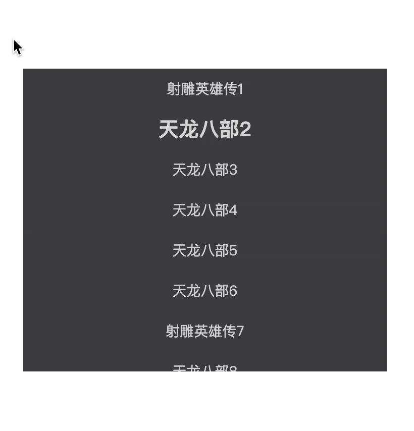

# react-auto-scroll-list

react 列表滚动组件，在时间间隔内进行列表的高亮突出，到底自动滚动。

## 功能

1. 支持自动滚动，超出容器高度，自动滚动适配。
2. 可自定义列表常规状态和高亮状态的样式。
3. 支持自定义滚动的时间间隔。

## 安装

通过 npm

```shell
    npm install react-auto-scroll-list --save
```

通过 yarn

```shell
    yarn add react-auto-scroll-list
```

## 示例



使用式例

```tsx
import classnames from "classnames";
import ReactAutoScrollList from "react-auto-scroll-list";
import mockData from "./mockData";
import styles from "./App.module.less";

function App() {
  return (
      <ReactAutoScrollList<{ label: string; value: number }>
        className={styles.container}
        renderItem={(item, index, active) => {
          const classNames = classnames(
            styles.listItem,
            active ? styles.active : styles.normal
          );
          return <div className={classNames}>{item.label}</div>;
        }}
        keyExtractor={(item, index) => `${index}`}
        data={mockData}
        timeInterval={1000}
      />
  );
}

export default App;

```

## api 参数

| 参数     | 说明              | 类型                   | 默认值|
|----------|-------------------|------------------------|------
| className    | 列表父容器 className            | -       string               | -
| renderItem | 列表渲染 | `(value: any) => void` |  (item: T, index: number, isActive: boolean) => React. ReactElement; |
| keyExtractor | 列表 key |  (item: T, index: number) => string | index 
| data | 列表数据源 | T[] | - |
| timeInterval | 列表状态切换间隔| number | 1000ms |
